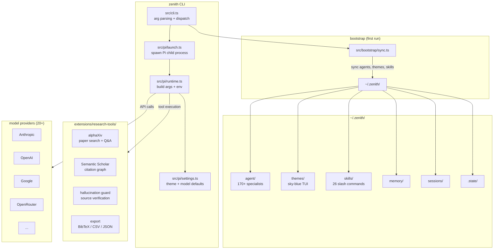
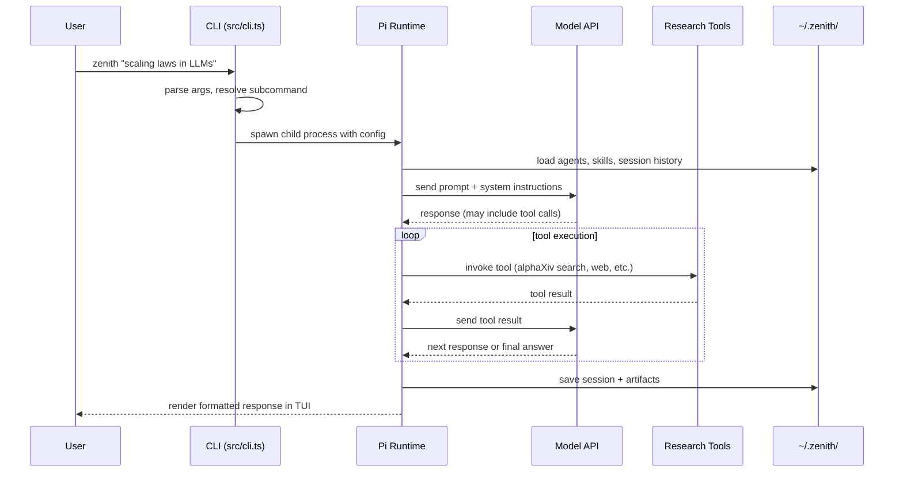
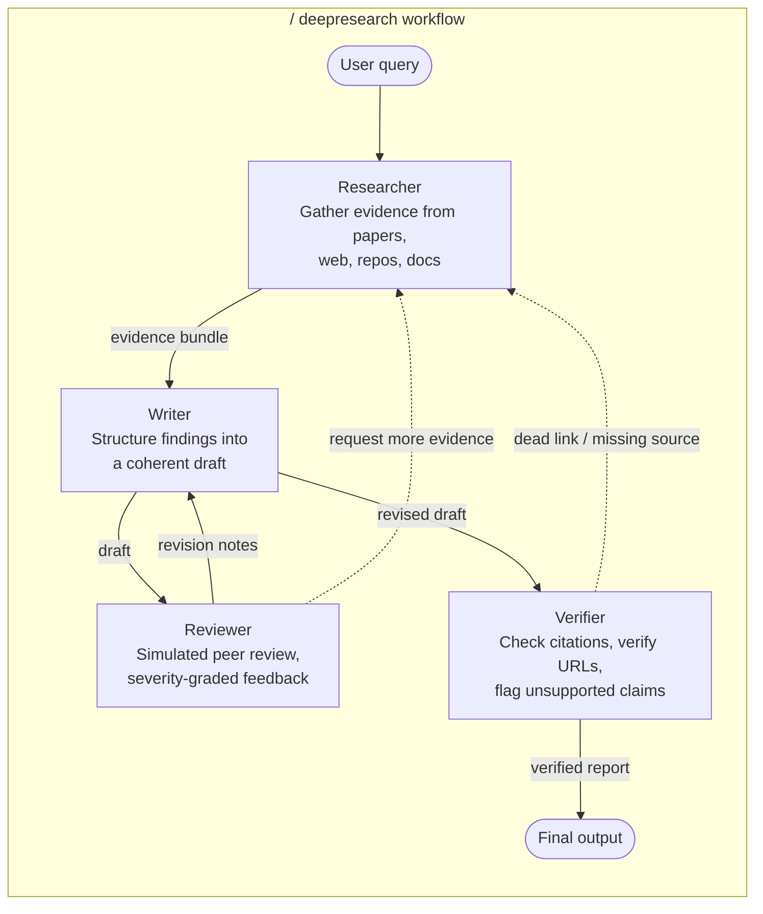

<p align="center">
  <a href="https://zenith.is">
    
  </a>
</p>
<p align="center">Terminal-native AI research agent. Search papers, run experiments, write drafts — all from your shell.</p>

---

## Install

```bash
npm install -g zenith-agent
```

Requires Node.js 20.19.0+. On first run, `zenith setup` walks you through model provider auth.

## What you type → what happens

```
$ zenith "what do we know about scaling laws"
→ Searches papers, synthesizes findings, returns a cited brief

$ zenith deepresearch "mechanistic interpretability"
→ Spawns researcher/writer/reviewer/verifier agents in parallel, produces a full report

$ zenith lit "RLHF alternatives"
→ Literature review: consensus, disagreements, open questions, citation graph

$ zenith audit 2401.12345
→ Reads the paper, clones the repo, flags mismatches between claims and code
```

No GUI, no web app. You stay in the terminal.

---

## Architecture

Zenith is a TypeScript CLI that wraps the [Pi coding agent runtime](https://github.com/badlogic/pi-mono). It adds research-specific skills, 170+ specialist agents, and integrations with paper search APIs.



The CLI parses your input, resolves model/provider config, and hands everything to Pi. Pi manages the conversation loop, tool calls, and agent orchestration. Research tools live in `extensions/` and get invoked as Pi tools during execution.

---

## Request flow

What actually happens when you ask Zenith something:



---

## Workflows

Every workflow is available as a slash command inside the REPL, or as a direct subcommand (`zenith deepresearch ...`).

| Command | What it does |
|---|---|
| `/deepresearch <topic>` | Multi-agent investigation with parallel researchers, synthesis, verification |
| `/lit <topic>` | Literature review from paper search and primary sources |
| `/review <artifact>` | Simulated peer review with severity-graded feedback |
| `/audit <paper>` | Paper claims vs. codebase mismatch audit |
| `/replicate <paper>` | Reproduce experiments on local or cloud GPUs |
| `/compare <topic>` | Side-by-side source comparison matrix |
| `/draft <topic>` | Paper-style draft from research findings |
| `/autoresearch <idea>` | Autonomous experiment loop — form hypothesis, test, iterate |
| `/watch <topic>` | Recurring monitor for new papers and developments |
| `/swarm <topic>` | Parallel multi-agent research swarm |
| `/citation-network <paper>` | Map citation graph and influence chains |
| `/dataset <query>` | Discover and evaluate relevant datasets |
| `/hypothesis <claim>` | Generate and evaluate testable hypotheses |
| `/stats <data>` | Statistical analysis and significance testing |
| `/systematic-review <topic>` | PRISMA-style systematic literature review |
| `/eli5 <topic>` | Plain-language explanation of complex research |
| `/export` | Export session as BibTeX, CSV, or JSON |
| `/paper-writing` | Full paper drafting pipeline |
| `/paper-code-audit` | Cross-reference paper methodology with implementation |
| `/session-search <query>` | Search across past research sessions |
| `/session-log` | Browse session history and artifacts |
| `/jobs` | Manage background compute jobs |
| `/preview` | Browser/PDF preview of generated artifacts |
| `/docker` | Run experiments in isolated containers |
| `/modal-compute` | Burst GPU compute via Modal |
| `/runpod-compute` | Persistent GPU pods via RunPod |

---

## Agents

Zenith ships 170+ specialist agent definitions in `~/.zenith/agent/`. Four core agents handle most research workflows:



**Researcher** — searches alphaXiv, Semantic Scholar, web, and repos. Returns structured evidence with source URLs.

**Writer** — takes evidence bundles and produces structured drafts. Handles formatting, section organization, inline citations.

**Reviewer** — reads drafts like a peer reviewer. Grades issues by severity (critical / major / minor), produces a revision plan.

**Verifier** — walks every citation in the final draft. Checks URLs resolve, checks that claims are actually supported by the cited source, removes dead links.

The remaining 166 specialists cover narrower domains — specific subfields, methodologies, statistical techniques, etc. They get dispatched automatically when the core agents need domain expertise.

---

## Configuration

Everything lives in `~/.zenith/`:

```
~/.zenith/
├── agent/          # agent definitions (synced from bundle)
├── memory/         # persistent memory across sessions
├── sessions/       # conversation history + artifacts
├── skills/         # skill definitions (slash commands)
├── themes/         # TUI themes (default: sky-blue)
├── .state/         # internal state
└── settings.json   # model provider, default model, preferences
```

**First-time setup:**

```bash
zenith setup          # guided wizard — picks provider, authenticates, sets defaults
zenith doctor         # diagnose config issues
```

**Model providers:** Zenith supports 20+ providers out of the box — Anthropic, OpenAI, Google, OpenRouter, and others. Auth is handled via OAuth or API key during setup. Switch models anytime:

```bash
zenith --model claude-sonnet-4-20250514 "your query"
```

---

## Contributing

```bash
git clone https://github.com/pkmdev-sec/zenith.git
cd zenith
nvm use || nvm install
npm install
npm test
npm run typecheck
npm run build
```

See [CONTRIBUTING.md](CONTRIBUTING.md) for the full guide.

---

[MIT License](LICENSE)
