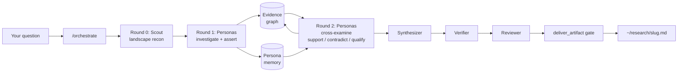
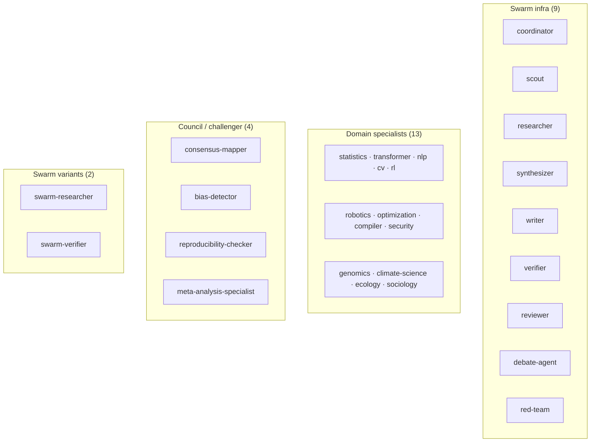

<p align="center">
  <a href="https://zenith.is">
    
  </a>
</p>
<p align="center">zenith — MiroFish-inspired research agent</p>

---

## Install

```bash
npm install -g zenith-agent
```

Requires Node.js 20.19.0+. First run: `zenith setup` walks you through
Anthropic auth. Zenith is **pinned to a single model — Anthropic
`claude-opus-4-6`** — so there is no model to choose. One research question,
one model, every role (researcher, verifier, reviewer, synthesizer, every
domain specialist). Pinning is enforced in code, not just the prompt.

## What you type → what happens

```
$ zenith "what do we know about scaling laws for tool-using agents"
→ Scout maps the landscape (round 0)
→ ~30 domain personas investigate in parallel (round 1), each with
  its own memory file and a shared evidence graph
→ The same personas cross-examine each other's round-1 claims (round 2),
  producing support / contradict / qualify edges
→ Synthesizer → Verifier → Reviewer → `deliver_artifact` quality gate
→ Drops a verified report at ~/research/scaling-laws-tool-agents.md
```

```
$ zenith --direct "what is RLHF"
→ Single-agent answer, no swarm.
```

```
$ zenith "mechanistic interpretability in small LLMs" --batched
→ Personas submitted as one Anthropic Message Batch (50% cost, bypasses
  RPM limits, typically 5–30 min turnaround). Zenith returns a batch id.
→ `zenith batch status <id>` — live progress
→ `zenith batch collect <id>` — ingest round-N results into the evidence
  graph + persona memory, then round N+1 can proceed
```

Every research question goes through the swarm by default. `--direct` is
the escape hatch for quick lookups.

---

## How the swarm works

The architecture is adapted from [MiroFish](https://github.com/666ghj/MiroFish) — a
multi-round, memory-persistent research swarm — and the Anthropic
[Message Batches API](https://docs.anthropic.com/en/docs/build-with-claude/batch-processing).
The core idea: N personas don't just fan out once; they **iterate across
rounds while sharing an evidence graph**, so round 2 can react to round 1.



**Round 0 — Scout.** Landscape recon: key subtopics, live debates, landmark
papers, named open questions. Shapes how personas are chosen.

**Round 1 — Investigate.** Each persona reads the scout output, does its
own evidence gathering, and commits claims to the shared evidence graph
(`append_evidence kind=assertion`) and its own memory file
(`append_persona_memory kind=claim`). Personas never see each other's
work in round 1.

**Round 2 — Cross-examine.** Each persona reads every *other* persona's
round-1 assertions via `query_evidence_graph`. For each claim they care
about they append a `support`, `contradict`, or `qualify` edge. The graph
now records not just opinions but the *shape* of agreement and dissent.

**Synthesize → Verify → Review → Deliver.** The synthesizer compresses
the graph (including disputed-claim clusters) into a coherent draft. The
verifier checks every citation. The reviewer grades severity. Only then
does `deliver_artifact` write to `~/research/`.

### Execution modes

| Mode | How persona calls run | Default personas | When |
|---|---|---|---|
| `sync`  | Tier-aware token-bucket queue against the `/v1/messages` endpoint | **30** | Default. Fast turnaround, costs full rate. |
| `batch` | Submitted as one job via `/v1/messages/batches` | **100** | 50% discount, bypasses RPM limits, 5–30 min turnaround. Use for >50 personas or tight rate budgets. |

Minimum personas per run is **10** — a gate enforced in `run_swarm`.

---

## Agent roster (28 agents)

Every agent file lives in `.zenith/agents/*.md`. The 13 domain
specialists and 4 council/challenger files carry the same "Swarm protocol
(MiroFish-style, 3 rounds)" block in their system prompts — that's how
they know how to read and write the evidence graph and their memory.
Infra agents (scout, synthesizer, writer, verifier, reviewer, …) have
their own role-specific prompts and operate on the graph from the outside.



- **Infra (9)**: `coordinator`, `scout`, `researcher`, `synthesizer`, `writer`, `verifier`, `reviewer`, `debate-agent`, `red-team`
- **Specialists (13)**: `statistics`, `transformer`, `nlp`, `cv`, `rl`, `robotics`, `optimization`, `compiler`, `security`, `genomics`, `climate-science`, `ecology`, `sociology`
- **Council / challenger (4)**: `consensus-mapper`, `bias-detector`, `reproducibility-checker`, `meta-analysis-specialist`
- **Swarm variants (2)**: `swarm-researcher`, `swarm-verifier`

The scout picks which specialists go into the persona pool for a given
question. You never pick agents — the swarm assembles itself.

### Scaling past 28 agents

Zenith ships 28 distinct **agent files**. Each persona instance in a run is
a parameterization of one of them — a `{specialist × lens × stance}`
triple. That's why "30 personas" is realistic with only 13 specialist
files: the scout can instantiate the same specialist multiple times with
different lenses (empiricist / theorist / critic / practitioner / historian
/ methodologist) and stances (advocate / skeptic / neutral / contrarian).

---

## Code-enforced gates

These are tools the model *must* call. The pipeline will not advance past
the next phase if the gate rejects.

| Gate | Enforces |
|---|---|
| `log_agent_spawn` | Budget: every spawned persona counts. No silent runaway. |
| `phase_gate` | Phase ordering: scout → round 1 → round 2 → synth → verify → review → deliver. |
| `deliver_artifact` | Final quality threshold before anything lands in `~/research/`. |

---

## Output

```
~/research/
└── scaling-laws-tool-agents.md          ← the report

~/.zenith/swarm-work/
└── scaling-laws-tool-agents/
    ├── scout-landscape.json             ← scout output
    ├── manifest.md                      ← what the plan was
    ├── evidence.jsonl                   ← every assertion + reaction
    ├── memory/
    │   └── <persona-id>.jsonl           ← per-persona memory
    ├── batches/
    │   └── msgbatch_<id>.json           ← batch mode only
    └── quality-gate.json                ← pass/fail + scores
```

---

## CLI reference

```bash
zenith setup                           # guided wizard
zenith doctor                          # diagnose config, auth, runtime
zenith status                          # current setup summary

zenith "your question"                 # default: /orchestrate
zenith --direct "your question"        # single-agent answer
zenith --batched "your question"       # route into batch mode
zenith --prompt "..."                  # one-shot, no REPL

zenith batch list                      # list tracked batches
zenith batch status <batchId>          # local + live status
zenith batch collect <batchId>         # ingest results into evidence + memory

zenith sync -- --force                 # re-sync bundled agents/skills/themes
zenith model list                      # show the pinned model
```

Slash commands inside the REPL: `/orchestrate`, `/swarm`, `/deepresearch`,
`/export`, `/eli5`, `/session-search`, `/session-log`, `/preview`, `/help`.

---

## Configuration

The single-model policy is enforced in `.zenith/settings.json`,
`~/.zenith/agent/settings.json`, `src/model/catalog.ts::SINGLE_MODEL_SPEC`,
and by stripping the `ANTHROPIC_MODEL`, `ANTHROPIC_MAX_TOKENS`,
`ANTHROPIC_SMALL_FAST_MODEL`, and `CLAUDE_MODEL` env vars before spawning
Pi (`src/pi/runtime.ts::PI_ENV_BLOCKLIST`). Changing the model is a
repo-level decision, not a per-run flag.

Rate-limit tier (for sync mode) is read from `ANTHROPIC_TIER` and picks a
token-bucket + concurrency profile. Tiers 1–4 supported; concurrency capped
at 8 to avoid 429 storms regardless of tier. See
`extensions/research-tools/rate-limit-queue.ts`.

---

## Contributing

```bash
git clone https://github.com/pkmdev-sec/zenith.git
cd zenith
nvm use || nvm install
npm install
npm test             # 134 passing
npm run typecheck
npm run lint         # prompts linter
npm run build
```

See [CONTRIBUTING.md](CONTRIBUTING.md).

---

[MIT License](LICENSE)
