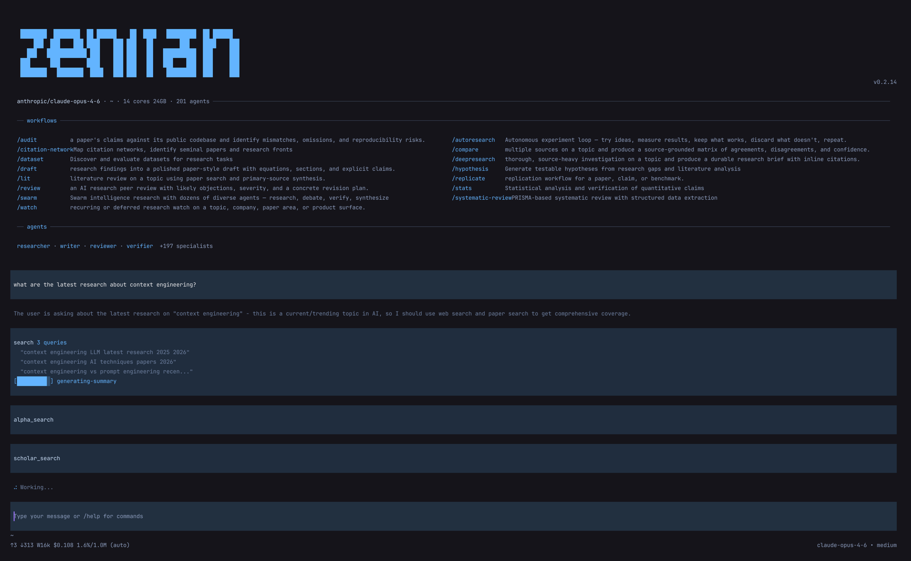
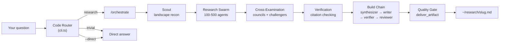
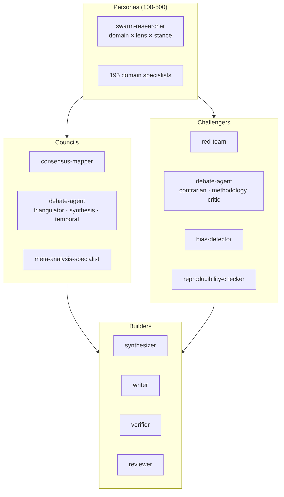

<p align="center">
  <a href="https://zenith.is">
    
  </a>
</p>
<p align="center">zenith research agent. 100–500 agents per research with their own spaces and groups to challenge , verify, debate etc with swarming integrated to get you the nearly accurate research with structure and detailed research.</p>

---

## Install

```bash
npm install -g zenith-agent
```

Requires Node.js 20.19.0+. First run: `zenith setup` walks you through provider auth.

## What you type → what happens

```
$ zenith "what do we know about scaling laws"
→ Dispatches 100-200 research agents across the topic
→ Councils cross-examine, challengers poke holes
→ Drops a verified report at ~/research/scaling-laws.md
```

```
$ zenith --direct "what is RLHF"
→ Single agent, straight answer, no swarm
```

```
$ zenith /deepresearch "mechanistic interpretability"
→ Full 300-500 agent swarm with extended verification
→ Scout → Research → Cross-Examination → Verification → Build → Quality Gate
→ ~/research/mechanistic-interpretability.md
```

Every research question goes through the swarm by default. `--direct` is the escape hatch for when you just want a quick answer.

---

## How the swarm works

When you ask Zenith a question, the CLI routes it into a 6-phase pipeline. There is no "maybe spawn agents" — the code enforces a minimum of 100 agents on every research question.



**Scout** — Runs landscape recon on the topic. Identifies key subtopics, active debates, landmark papers, and knowledge gaps. This shapes how the swarm divides its work.

**Research Swarm** — 100–500 agents fan out across the topic. Each agent is a unique persona — a combination of domain expertise, analytical lens, and epistemic stance. A question about RLHF might get a reinforcement learning theorist, a safety researcher arguing from first principles, a practitioner who's shipped RLHF systems, and 97+ more perspectives.

**Cross-Examination** — Councils find consensus. Challengers attack it. Nothing passes through without being stress-tested from multiple angles.

**Verification** — Every citation gets checked. Dead links get flagged. Claims without adequate sourcing get removed or marked.

**Build Chain** — The synthesizer compresses hundreds of agent outputs into a coherent narrative. The writer structures it. The verifier double-checks. The reviewer grades it.

**Quality Gate** — The `deliver_artifact` gate enforces minimum quality before anything touches `~/research/`. If the report doesn't pass, it loops back.

### Two tiers

| Tier | Agents | When |
|---|---|---|
| **Broad** (default) | 100–200 | Every research question |
| **Expensive** (`/deepresearch`) | 300–500 | When you ask for it explicitly |

---

## 203 specialist agents



| Role | Agents | What they do |
|---|---|---|
| **Core 4** | researcher, writer, reviewer, verifier | The backbone — gather, write, critique, verify |
| **Swarm infra** | synthesizer, coordinator, scout, debate-agent | Orchestrate, compress, and stress-test swarm outputs |
| **Domain specialists** | 195 agents | Narrow expertise — specific fields, methods, statistical techniques, historical context |
| **Councils** | consensus-mapper, debate-agent (triangulator/synthesis/temporal), meta-analysis-specialist | Find where agents agree, map the shape of disagreement |
| **Challengers** | red-team, debate-agent (contrarian/methodology critic), bias-detector, reproducibility-checker | Attack consensus, find blind spots, flag unreproducible claims |

The 195 domain specialists are dispatched automatically based on what the scout identifies. You never pick agents — the swarm assembles itself.

---

## Code-enforced guarantees

These aren't suggestions in a system prompt. They're gates in the code that prevent the pipeline from proceeding if conditions aren't met.

| Gate | What it enforces |
|---|---|
| `log_agent_spawn` | Tracks every agent spawned against a budget. No silent runaway. |
| `phase_gate` | Phases run in strict order: scout → swarm → cross-exam → verify → build → quality. No skipping. |
| `deliver_artifact` | Final output must pass quality checks before being written to `~/research/`. Failures loop back. |

---

## Output

**What you see:** `~/research/<slug>.md` — a clean, cited research report.

**What's hidden:** `~/.zenith/swarm-work/` — all the raw agent outputs, council deliberations, challenger attacks, and intermediate drafts. Useful for debugging or deep-diving into how the swarm reached its conclusions, but you never need to look at it.

```
~/research/
└── scaling-laws.md              ← your report

~/.zenith/swarm-work/
└── scaling-laws/
    ├── scout-landscape.json     ← what the scout found
    ├── personas/                ← individual agent outputs
    ├── councils/                ← consensus maps
    ├── challengers/             ← attack logs
    ├── build-chain/             ← synthesis drafts
    └── quality-gate.json        ← pass/fail + scores
```

---

## Skills

Seven slash commands. That's it.

| Skill | What it does |
|---|---|
| `/deep-research` | Full 300–500 agent expensive-tier swarm |
| `/swarm-research` | Broad-tier 100–200 agent swarm (also the default for bare questions) |
| `/export` | Export session as BibTeX, CSV, or JSON |
| `/eli5` | Plain-language explanation of complex research |
| `/session-search` | Search across past research sessions |
| `/session-log` | Browse session history and artifacts |
| `/preview` | Browser/PDF preview of generated artifacts |

---

## Configuration

```bash
zenith setup              # guided wizard — provider, auth, defaults
zenith doctor             # diagnose config issues
zenith --model <id> "q"   # override model for a single query
zenith --direct "q"       # skip the swarm, single-agent answer
zenith sync -- --force    # clean re-sync of agents, skills, themes
```

**Model providers:** 20+ out of the box — Anthropic, OpenAI, Google, OpenRouter, and others. Auth via OAuth or API key during setup.

**Prompts:** Three built-in — `orchestrate` (default routing), `swarm` (broad-tier dispatch), `deepresearch` (expensive-tier dispatch).

**Theme:** Sky-blue TUI. Everything lives in `~/.zenith/`.

---

## Contributing

```bash
git clone https://github.com/pkmdev-sec/zenith.git
cd zenith
nvm use || nvm install
npm install
npm test
npm run typecheck
npm run build
```

See [CONTRIBUTING.md](CONTRIBUTING.md) for the full guide.

---

[MIT License](LICENSE)
